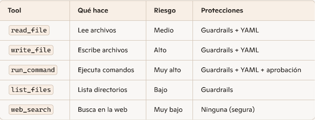
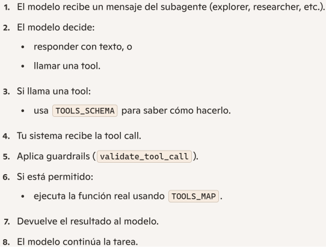

A continuación dejo una explicación del código celda a celda. 

**Celda 1**:

En primer lugar se importan las librerías y módulos que se usarán a lo largo del proyecto. 
Se obtienen las API keys. La de ChatGPT proveída por la cátedra así como las de Langfuse. En Colab intentará leerlas desde userdata. 
Se crea al cliente de OpenAI para poder llamar modelos, en este caso, gpt-5-nano. A continuación se definen los nombres de modelos que el agente usará.
Uno es para generación de texto y el otro para embeddings vectoriales.
En el directorio /content/workspace donde trabajará (lectura y escritura) el agente. Aquí se generan archivos, logs y resultados. 
Finalmente los mensajes confirman que todo está inicializado. 

**Celda 2**:

Aquí tiene lugrar la inicialización de la conexión a Langfuse. La importación trae creación de traces, creación de spans, logging de input/output, 
métricas de latencia, almacenamiento de prompts y dashboards de ejecución. 
Luego con la inicialización del cliente se utilizan las claves. Se utiliza una instancia cloud en lugar de una self-hosted. 
Resumiendo, se conecta el agente con el sistema de observabilidad. 
Posterior a la creación del cliente hace auth_check() para validar las credenciales. En el caso en que fallara, se muestra el tipo de error, el mensaje y los primeros caracteres de cada clave. 

Langfuse es una plataforma de ingeniería de IA de código abierto diseñada para monitorizar, evaluar y optimizar aplicaciones que utilizan LLMs. 
Funciona como una "caja negra" que registra y analiza todo lo que ocurre dentro de tus agentes o chatbots de IA en tiempo real.

**Celda 3**:

Esta se ocupa de crear una rchivo de configuración para el agente definiendo qué puede leer, escribir o ejecutar dentro del workspace. 
El YAML define ante todo el directorio en el que estará trabajando. Se niega la lectura de los archivos más sensibles. 
No puede modificar el agente archivos de workflows lo lockfiles (controla acceso arecursos compartidos). Se bloquean además los comandos peligrosos. 
Otros se pueden ejecutar pero requiriendo aprobación previa. _#Revisar qué pasa con los GUARDRAILS
Postrera configuración del agent.config.yaml

**Celda 4**:

Se combinan guardrails internos y políticas de YAML para decidir si una acción está permitida o no. 
En primer lugar se carga la configutación del YAML y abre agent.config.yaml. Se paresea y queda disponible como un diccionario e Python. El agente lo usará para saber que está permitido y qué no. 
La funcionón matches_any sirve para comparar rutas o comandos según patrones. 
Mientras, la función validate_tool_call decide si el agente puede ejecutar una herramienta o no. 
Los guardrails pertenecen al sistema del agente. Son reglas itnernas del agente que no dependen del YAML. No se pueden desactivar, lo que hacen es proteger el entorno del agente. Las políticas YAML configurables por el usuario
protegen el proyecto y workspace. 

**Celda 5**:

En primer lugar se define una lista de URLs de docuementación de React. Se trata de archivos .md alojados en GitHub. 
fetch_doc hace una petición HTTP sin tocar el filsystemlocal ni ejecutar comandos o usar herrameintas del agente. 
Descarga cada documetno y lo guarda en una lista de Python para que quede en memoria. No se escribe al disco.Los muestra por consola. 

**Celda 6**:

chunk_text divide el texto en pedazos, genera un id con hashlib.md5 y arma diccionarios con metadata. Todo ocurre en memoria sin leer ni escribir archivos. 
get_embedding llama a la API de OpenAI. 
Más tarde el loop genera chunks y embeddings. Otra vez se ejecuta todo en memoria. 

**Celda 7**:
Es el ❤️ del RAG (conecta al LLM con fuentes de información externas).
Indexa los chunks: las lsitas rag_texts, rag_embeddings y rag_metadata son listas paralelas que conforman una DB en memoria. 
Generación de embeddings: tomando cada chunk, enero su embedding con OpenAI y lo guardo en memoria. Esto convierte la documetnación en representaciones vectoriales que permiten 
aplicar una búsqueda semántica. 
Construcción de la matriz NumPy: optimizaz la búsqueda vectorial usando oepraciones matriciales. 
cosine_similarity: calcula la similitud entre el embedding del query y todos los embeddings de la DB. Usa producto punto entre los vectores normalizados. 
rag_search:

1. Se convierte la query en embedding.
2. Se calcula la similitud con todos los chunks.
3. Se ordena por score.
4. Devuelve los mejores.

Cada resultado incluye:

* texto del chunk,
* título del documento,
* URL original,
* score de similitud,
* etiqueta "source": "RAG"

Resumiendo, implementa el motor rag en memoria.

**Celda 8**:

Aquí se desarrolla la capa de memoria del agente y es calve para que el sistema tenga persistencia entre sesiones y estado compartido dentro de una misma sesión.
El task_state es una memoria temporal que sólo vive durante la sesión actual. Es el estado compartido entre subagentes durante una única ejecución del agente. 
No se guarda en disco sino que se peirde al terminar la sesión. Constituye un diario de trabajo de la sesión actual. 

* Guarda el pedido original del usuario.
* Registra qué subagentes hicieron qué.
* Guarda qué archivos se modificaron.
* Guarda qué fuentes se consultaron (RAG o web).
* Guarda observaciones internas del agente.
* Guarda qué chunks del RAG se usaron.

log_progress se encarga del logging interno del agente. Sirve para:

* registrar pasos del agente
* mostrar trazas en consola
* dejar evidencia de qué hizo cada subagente

tareas que pueden ayudar al hacer un debugging o reconstruir la sesión. 

project_memory es la memoria persistente entre sesiones. "project_memory.json" sí se guarda en disco. Es una memoria a largo plazo del proyecto donde
el agente puede recordar sesiones anteriores, decisiones arquitectónicas, archivos importantes, dependencias del proyecto, convenciones de estilo y bugs investigados.
El contenido:

{
    "sessions": [],
    "architecture": {},
    "key_files": [],
    "dependencies": {},
    "conventions": [],
    "decisions": [],
    "bugs_investigated": []
}
 Permite la conitnuidad entre ejecuciones. 

load_memory carga la memoria persistente. Abre el archivo, lo parsea y devuelve. Si no existe, crea una memoria nueva vacía.

save_memory guarda la memoria en disco, permitiendo que el agente recuerde entre sesiones. 
update_memory la actualiza al finalizar cada sesión. Guarda fecha, pedido original, repo trabajado, archivos modificados, observaciones y feuntes consultadas.
Si el subagente explorer detectó arquitectura del repo, se guarda.

La inicialización final deja la memoria temporal lista para la sesión (task_state) y la memoria persistente cargada desde el disco (project_memory). 

**Celda 9**:

Esta se presenta como la celda más compleja dado que orquesta:

* manejo de contexto largo
* resumen automático del historial
* detección de loops
* ejecución de herramientas con guardrails
* el inner loop que gobierna a cada sub-agente

En primer lugar se define cómo se cuentan los tokens y el máximo de tokenns permitido antes de resumir.
En caso de llegar al límite no se quedará sin contexto porque resume. 
count_tokens(messages) ceunta los tokens del historial para decidir si hay que resumir o no. 
summarize_history(messages)detecta si el historial es demasiado largo, conserva el sistem prompt original y los útlimos 4 mensjaes para lograr continuidad. El
resto lo resume. Con un mensaje que contiene el resumen reemplaza todo el historial viejo. Evita pérdida de contexto al mismo tiempo que no gasta tokens. 
detect_loop() detecta si el agente está repitiendo la misma acción sin generar un avance efectivo. 
Construye una calve "tool_name:args" y procede abuscar cuantas veces aparece en state["progress"]. Si lo enceuntra 2 o más veces --> se formó un loop. 

Cada subagente corre el inner_loop_with_guards(). CAda vuelta del loop es una acción del subagente. Si el contexto creciera demasiado: se resume, conserva lo iportante evitando 
overflow en el modelo. El modelo esquien decide si responde con texto o llamando a una tool. Si responde SIN tool, finaliza el subagente. 
Si no, se agrega el mensaje con tool_calls al historial y procesa cada tool call. También detecta formación de bucles. 

* guardrails del sistema
* guardrails del YAML
* permisos de lectura/escritura
* aprobación de comandos peligrosos

Tool permitida --> ejecuta
Tool bloqueada --> devuevle mensaje de error

Agega el resultado al historial. 

**Celda 10**:

Se toma todo lo construído previamente y se convierte en un agente completo que analiza un repo de React completo. 
Se encarga literalmente de todo:

* clona el repo
* carga memoria previa
* crea el estado de la sesión
* inicia trazas en Langfuse
* ejecuta los subagentes en orden
* actualiza memoria persistente
* imprime un reporte final
* Manejo de errores y flush de langfuse

**Celda 11**:

Aquí se definen las herramientas reales que el agente puede ejecutar cuadno el modelo hace una tool call. 
Se podrían ver como las "manos" del agente: 

**Celda 12**:

No ejecuta nada por si sola sino que define el catálofo de herrameintas que el agente puede usar. Se trata de la interfaz pública
que el LLM ve y puede llamar.
TOOLS_SCHEMA es lo que el LLM ve meintras que TOOLS_MAP es lo que Pyhton ejecuta. DESTRUCTIVE_TOOLS son las peligrosas. 

Se encaja en el proceso según el siguiente ciclo:

**Celda 13**:

Crea un archivo de guardrails del sistema independiente del YAML que se usó antes. Defino los que el agente usa en 
validate_tool_call antes de aplicar las reglas YAML. 

**Celda 14**:

Consiste en tests de los guardrails, comprieba que funcionan en escenarios peligrosos. 

**Celda 15**:
Carga la configuración de los guardrails. 

**Celda 16**:

Agente interactivo completo con el cual puedo interactuar por consola.
Es un agente genérico de código.

1) Prompt: da personalidad y reglas del agente
2) Se ejecutan herramientas con guardrails y supervisión. 
3) razonamiento + tool calling
4) modo plan
5) loop externo: presenta un chat interactivo que se inicializa, aporta comandos especiales, chequea el plan, etc.

**Celda 17**:
Agente, analizá este repo de React y generá un reporte completo de arquitectura.
Ejecuta todo el pipeline construído. 

**Disclaimer**‼️

Siguiendo los requerimientos de la consigna, state es el mismo objeto compartido entre el agente y **TODOS** los subagentes. 
Por tanto, cuando el researcher intenta list_files sobre una carpeta que fuera lsitada múltiples veces por Explorer, hereda el conteo
y queda bloqueado el intento aunque no haya iterado sobre sí mismo. 
El detector de loops opera sobre el historial global de la tarea, no por subagente. 
Para solucionarlo se puede optar por otra lógica de comparacion, pasando de:

f"{tool_name}:{json.dumps(args, sort_keys=True)}"

a:

f"{subagent_name}:{tool_name}:{json.dumps(args, sort_keys=True)}"

De este modo, aunque todos continuarán operando sober la misma lista, cada subagente obtendrá información de la actividad propia. 

*RAG: técnica de IA que conecta un modelo de lenguaje con fuentes de información externas. Esto evita alucinaciones y utiliza infromación actualizada.
Si se conecta al agente a documentos internos, se puede personalizar la feunte de información. 
